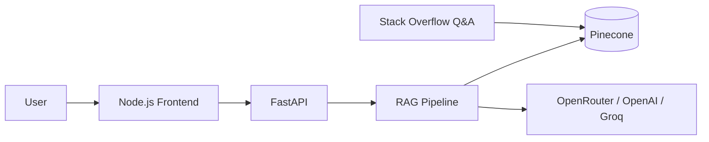

# Python Programming Q&A Assistant

AI-powered FastAPI service that answers Python questions using a retrieval-augmented generation (RAG) pipeline grounded in Stack Overflow Python Q&A data.

## Live Demo

| Service | URL |
|---------|-----|
| **Frontend (chat UI)** | [https://ai-codeassit-1.onrender.com/](https://ai-codeassit-1.onrender.com/) |
| **Backend API** | [https://ai-codeassit.onrender.com/](https://ai-codeassit.onrender.com/) |
| **API Docs (Swagger)** | [https://ai-codeassit.onrender.com/docs](https://ai-codeassit.onrender.com/docs) |
| **API Docs (JSON)** | [https://ai-codeassit.onrender.com/api/docs](https://ai-codeassit.onrender.com/api/docs) |
| **Health Check** | [https://ai-codeassit.onrender.com/health](https://ai-codeassit.onrender.com/health) |

## Features

- RAG pipeline with LangChain, Pinecone, and configurable embeddings
- `POST /ask` for grounded answers with source citations
- `GET /health` for service and index status
- Works in retrieval-only mode without an LLM key; enable generation with OpenRouter, OpenAI, or Groq
- Node.js frontend with chat UI, example prompts, and source citations
- Pytest suite and documented evaluation queries

## Architecture



## Quick Start

### 1. Clone and install

```bash
python -m venv .venv
.venv\Scripts\activate
pip install -r requirements.txt
```

### 2. Configure environment

```bash
copy .env.example .env
```

Set `PINECONE_API_KEY`, `OPENROUTER_API_KEY`, and related settings in `.env` (see `.env.example`).

### 3. Build the vector index

```bash
python scripts/build_index.py
```

By default this indexes `data/sample_python_qa.json` using lightweight hash embeddings. For higher-quality retrieval, set `EMBEDDING_PROVIDER=huggingface` or `openai`.

### 4. Run the API

```bash
uvicorn app.main:app --reload --host 0.0.0.0 --port 8000
```

Open Swagger docs at `http://localhost:8000/docs`.

### 5. Run the frontend

```bash
cd frontend
copy .env.example .env
npm install
npm start
```

Open the app at `http://localhost:3000`. The Node server proxies `/api/health` and `/api/ask` to the FastAPI backend.

## API

### Documentation

| URL | Description |
|-----|-------------|
| `/docs` | Interactive Swagger UI |
| `/redoc` | ReDoc documentation |
| `/openapi.json` | OpenAPI schema (JSON) |
| `/api/docs` | API overview (JSON) |
| `/` | Quick links to all endpoints |

### `GET /api/docs`

```json
{
  "name": "Python Programming Q&A Assistant",
  "version": "1.0.0",
  "swagger_ui": "/docs",
  "redoc": "/redoc",
  "openapi_schema": "/openapi.json",
  "endpoints": [...]
}
```

### `GET /health`

```json
{
  "status": "ok",
  "index_ready": true,
  "llm_configured": false,
  "document_count": 20
}
```

### `POST /ask`

Request:

```json
{
  "question": "How do I read a CSV file in pandas?"
}
```

Response:

```json
{
  "question": "How do I read a CSV file in pandas?",
  "answer": "...",
  "sources": [
    {
      "title": "How to read a CSV file in pandas?",
      "score": 0.91,
      "excerpt": "Title: How to read a CSV file in pandas?..."
    }
  ],
  "mode": "retrieval_only"
}
```

## Full Kaggle Dataset

The assessment dataset is [Stack Overflow — Python Questions & Answers](https://www.kaggle.com/datasets/stackoverflow/pythonquestions).

1. Install Kaggle CLI credentials (`%USERPROFILE%\.kaggle\kaggle.json` on Windows)
2. Download:

```bash
python scripts/download_data.py
```

3. Point `DATA_PATH` in `.env` to the downloaded CSV
4. Rebuild the index:

```bash
python scripts/build_index.py --data-path data/your_file.csv
```

Expected CSV fields (any matching alias works): `title`, `question`/`body`, `answer`/`accepted_answer`, optional `tags`.

## Testing

```bash
pytest -q
python scripts/run_test_queries.py
```

See `test_results/TEST_RESULTS.md` for evaluation notes.

## Deployment

### Render (deployed)

| Service | URL |
|---------|-----|
| Frontend | https://ai-codeassit-1.onrender.com |
| Backend | https://ai-codeassit.onrender.com |

Frontend env: `API_BASE_URL=https://ai-codeassit.onrender.com`

### Docker

```bash
docker build -t python-qa-assistant .
docker run -p 8000:8000 --env-file .env python-qa-assistant
```

### Render / Railway / Hugging Face Spaces

- Use the included `Dockerfile`
- Set environment variables from `.env.example`
- Expose port `8000`
- Set `PINECONE_API_KEY` and related settings from `.env.example`
- Persist vectors in your Pinecone index (no local vector DB volume needed)

**Deployed App URL:** https://ai-codeassit-1.onrender.com

## Project Structure

```text
app/
  main.py              # FastAPI app
  config.py            # Settings
  rag/                 # RAG pipeline
  models/              # Pydantic schemas
frontend/
  server.js            # Express server + API proxy
  public/              # Chat UI
scripts/
  build_index.py
  download_data.py
  run_test_queries.py
tests/
data/
test_results/
docs/
```

## Scaling Notes

See `docs/SLIDES.md` for architecture decisions and a scaling plan for 100+ concurrent users.

## License

Assessment project for Analytics Vidhya AI Engineer hiring process.
