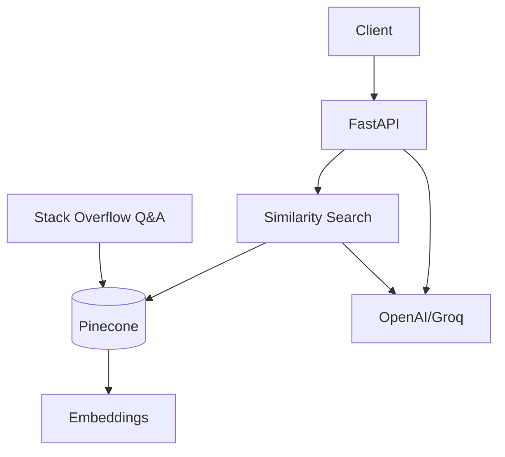

# Python Q&A Assistant — Slide Deck (10 slides max)

## Slide 1 — Title
**Python Programming Q&A Assistant**
- Analytics Vidhya AI Engineer Assessment
- Grounded answers for Python learners

## Slide 2 — Problem
- Learners ask repetitive Python/data-science questions
- Generic LLMs can hallucinate APIs or outdated patterns
- Need accurate, source-grounded tutoring at API speed

## Slide 3 — Solution
- RAG pipeline over Stack Overflow Python Q&A
- FastAPI service with `/ask` and `/health`
- Retrieval + optional LLM synthesis

## Slide 4 — Architecture

## Slide 5 — Key Design Decisions
- **Pinecone**: managed vector database, scales for production
- **HuggingFace embeddings**: no embedding API cost
- **Top-k retrieval**: balances context size and latency
- **Grounded prompt**: answer only from retrieved context
- **Retrieval-only fallback**: works without LLM credentials

## Slide 6 — Data Pipeline
1. Ingest Kaggle CSV or bundled sample JSON
2. Normalize Q&A into document text
3. Embed and store in Pinecone
4. Rebuild script for fresh corpora

## Slide 7 — API Surface
- `GET /health` — readiness, index count, LLM config
- `POST /ask` — question in, grounded answer + sources out
- Validation, structured errors, OpenAPI docs

## Slide 8 — Testing & Quality
- Pytest for health/ask/validation paths
- 10 evaluation queries documented
- Edge cases: short input, out-of-domain questions
- Manual review of source relevance

## Slide 9 — Scale to 100+ Concurrent Users
- **Async FastAPI** + worker pool (Gunicorn/Uvicorn workers)
- **Vector DB**: Pinecone with namespaces for environment isolation
- **Caching**: Redis for frequent questions (question hash → answer)
- **Batch embeddings** on ingest, not request time
- **LLM routing**: smaller model for easy queries, larger for complex
- **Rate limiting** and request timeouts
- **Observability**: latency, retrieval scores, token usage

## Slide 10 — Cost & Next Steps
- Embedding cost: local/offline at ingest time
- Main runtime cost: LLM tokens per `/ask`
- Caching + top-k tuning reduce spend
- Next: feedback loop, answer rating, incremental index updates
